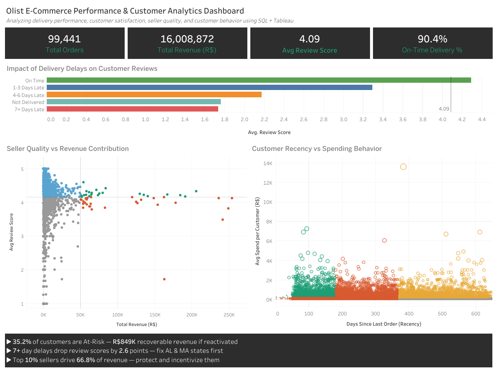

# Olist E-Commerce Performance & Customer Analytics Dashboard 

## Dashboard Preview




\## Project Overview

This project analyzes the Brazilian Olist E-Commerce dataset containing 100k+ orders, customer reviews, seller performance, payment behavior, and delivery operations data.


Using MySQL and Tableau, the project focuses on identifying operational inefficiencies, customer retention risks, seller contribution patterns, and the impact of delivery performance on customer satisfaction.


Key analysis areas include:

\- Delivery delay impact on customer reviews

\- RFM-based customer segmentation

\- Seller revenue and quality analysis

\- Payment and installment behavior analysis

\- Regional delivery performance comparison

\- Revenue concentration analysis


The final interactive Tableau dashboard simulates a real-world business intelligence solution used by e-commerce companies such as Flipkart, Amazon, or Meesho to monitor operational performance and customer behavior.


\## Business Problem


E-commerce platforms handle large-scale operational and customer data daily, but identifying actionable business insights from this data remains a major challenge.


This project aims to solve several high-impact business problems:


\- Understanding how delivery delays affect customer satisfaction and reviews

\- Identifying customer segments that are at risk of churn or inactivity

\- Analyzing which sellers contribute the highest platform revenue

\- Detecting revenue concentration among top-performing sellers

\- Evaluating customer payment behavior and installment usage

\- Monitoring regional operational inefficiencies


Key findings from the analysis include:

\- 7+ day delivery delays reduce average review scores from 4.29 to 1.70

\- Top 10% sellers contribute 66.8% of total platform revenue

\- 35.2% of customers fall into the At-Risk segment

\- SP alone contributes 37.1% of platform revenue

\- Installment buyers spend 105.2% more per order than non-installment buyers


The dashboard enables business stakeholders to identify operational bottlenecks, improve customer retention, and optimize seller performance using data-driven decision-making.


\## Tools \& Technologies Used

\- \*\*SQL (MySQL)\*\* — Data cleaning, joins, KPI analysis, RFM segmentation, seller analysis, window functions, indexing optimization

\- \*\*Tableau Public\*\* — Interactive dashboard creation, KPI visualization, action filters, drill-down analysis, Viz in Tooltip

\- \*\*Excel / CSV\*\* — Raw dataset handling and preprocessing

\- \*\*Git \& GitHub\*\* — Version control and project documentation

Dataset:

\- Olist Brazilian E-Commerce Public Dataset

\- 100k+ orders across multiple business dimensions including customers, sellers, payments, reviews, and deliveries


\## Dashboard Features

The interactive Tableau dashboard includes:


\### KPI Layer

\- Total Orders

\- Total Revenue

\- Average Review Score

\- On-Time Delivery Percentage


\### Delivery Performance Analysis

\- Impact of delivery delays on customer reviews

\- Reference line comparison against overall average review score

\- Delay bucket segmentation (On Time, 1–3 Days Late, 4–6 Days Late, 7+ Days Late)


\### Seller Performance Analysis

\- Seller Quality vs Revenue Contribution scatterplot

\- Revenue concentration analysis

\- Drill-down category analysis using Viz in Tooltip


\### Customer Behavior Analysis

\- RFM-based customer segmentation

\- Customer Recency vs Spending Behavior visualization

\- Identification of At-Risk and inactive customer groups


\### Interactive Features

\- Dashboard action filters

\- Cross-chart interactions

\- Dynamic drill-down analysis

\- Interactive tooltips


\## Key Business Insights

\### Customer Satisfaction \& Delivery

\- 7+ day delays reduce average review scores from 4.29 to 1.70

\- Point drop for 5+ day delays: 2.6 points

\- Overall late delivery rate: 8.1%

\- Average delay duration: 8.9 days


\### Regional Performance

\- SP contributes 37.1% of total revenue

\- SP + RJ + MG together contribute 62.1% of platform revenue

\- Northeast states show 2.1x higher late delivery rate compared to SP

\- Worst delivery states: AL (23.9%) and MA (19.7%)


\### Customer Segmentation

\- 35.2% customers belong to the At-Risk segment

\- Recoverable At-Risk revenue estimated at R$849K

\- Hibernating + Lost customers account for 40% of all customers


\### Seller Analysis

\- Top 10% sellers contribute 66.8% of platform revenue

\- Top 5 product categories contribute 39.2% of total revenue


\### Payment Behavior

\- Credit cards account for 73.9% of transactions

\- Installment buyers spend 105.2% more per order


\## SQL Workflow

The SQL workflow was divided into multiple stages:


1\. Database creation and schema setup

2\. Data loading and validation

3\. Data cleaning and preprocessing

4\. KPI and operational analysis

5\. Customer RFM segmentation

6\. Seller performance analysis

7\. Query optimization using indexes


Advanced SQL concepts used:

\- Common Table Expressions (CTEs)

\- Window Functions

\- Aggregate Functions

\- CASE Statements

\- JOIN Operations

\- Index Optimization

\- RFM Segmentation Logic


\## Tableau Dashboard

\*\*Olist E-Commerce Performance \& Customer Analytics Dashboard\*\*


Key Tableau features implemented:

\- KPI cards

\- Interactive action filters

\- Reference lines

\- Scatterplot analysis

\- RFM segmentation visualization

\- Viz in Tooltip

\- Executive insight panel


Tableau Public Dashboard:

\[https://public.tableau.com/app/profile/mayur.patil7608/viz/OlistE-CommercePerformanceCustomerAnalyticsDashboard/Dashboard1]


\## Project Structure

```text

olist-ecommerce-performance-dashboard/

│

├── dashboard/

│   └── olist-ecommerce-performance-dashboard-final.twbx

│

├── sql\_scripts/

│   ├── 01\_create\_database.sql

│   ├── 02\_create\_tables.sql

│   ├── 03\_data\_loading.sql

│   ├── 04\_data\_cleaning\_validation.sql

│   ├── 05\_business\_analysis.sql

│   └── 06\_indexes\_optimization.sql

│

├── screenshots/

│   └── final\_dashboard.png

│

├── README.md

```


\## How to Run This Project

1\. Import the Olist dataset into MySQL

2\. Execute SQL scripts in sequence

3\. Open the Tableau workbook (.twbx)

4\. Refresh data connections if required

5\. Explore the interactive dashboard


\## Author

Mayur Patil


Final Year Data Science Engineering Student  

Interested in Data Analytics, Business Intelligence, SQL, and Data Visualization

